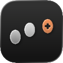

<div align="center">
  <h1>
    MiddleClick+ 
  </h1>
  <p>
    <b>Trackpad gestures for middle click and media play/pause on macOS</b>
  </p>
  <p>
    A personal fork of MiddleClick, installable from a local release zip or by building from source.
  </p>
  <br>
</div>


## Usage

By default:

- 3-finger click or tap emits a middle click.
- 4-finger tap sends media Play/Pause.

Middle click works system-wide, for example:

- Close browser tabs by middle-clicking them.
- Open links in a background tab in Safari.
- Paste selected text in Terminal.

Play/Pause uses the system media key event, equivalent to pressing the Mac media play/pause key.

## Install

This fork can be installed from a GitHub Release zip or built locally from source.

### Option 1: GitHub Release

Download `MiddleClickPlus-local.zip` from this repository's Releases page, unzip it, and move `MiddleClickPlus.app` to `/Applications`.

This app is ad-hoc signed for local use, not Developer ID signed or notarized. macOS may warn that it cannot verify the developer. If that happens, open it from System Settings → Privacy & Security, or right-click `MiddleClickPlus.app` and choose Open.

After the first launch, grant Accessibility permission in System Settings:

1. Open System Settings.
2. Go to Privacy & Security.
3. Open Accessibility.
4. Enable `MiddleClick+`.
5. Quit and reopen `MiddleClick+` if macOS asks.

Set the default local gestures:

```sh
defaults write com.alexander.MiddleClickPlus fingers 3
defaults write com.alexander.MiddleClickPlus mediaPlayPauseFingers 4
```

### Option 2: Build Locally

#### Requirements

- macOS
- Full Xcode installed from the App Store or Apple Developer
- Xcode command line tools selected with `xcode-select`

If `xcodebuild` reports that only Command Line Tools are selected, run:

```sh
sudo xcode-select -s /Applications/Xcode.app/Contents/Developer
```

If that path is invalid, install full Xcode first. Command Line Tools alone are not enough to build this app target.

#### Build and Run

```sh
git clone <your-fork-url>
cd MiddleClick
make run
```

This builds the Debug app and starts it from Xcode's DerivedData build output.

#### Install to Applications

For regular use, copy the built app to `/Applications` so macOS permissions remain tied to a stable app path:

```sh
make install-local
```

This also sets the default local gestures:

```sh
defaults write com.alexander.MiddleClickPlus fingers 3
defaults write com.alexander.MiddleClickPlus mediaPlayPauseFingers 4
```

After the first launch, grant Accessibility permission in System Settings:

1. Open System Settings.
2. Go to Privacy & Security.
3. Open Accessibility.
4. Enable `MiddleClick+`.
5. Quit and reopen `MiddleClick+` if macOS asks.

If gestures do not work and logs show `Failed to create event tap`, reset the Accessibility permission:

```sh
make reset-accessibility
```

Then enable `MiddleClick+` again in System Settings → Privacy & Security → Accessibility.

### Creating a Release Zip

To create the `.app` zip for a GitHub Release:

```sh
make package-local
```

Upload `build/MiddleClickPlus-local.zip` to the GitHub Release.

## Preferences

### Hide Status Bar Item

> This is a native macOS feature — works the same for any app.

1. Hold `⌘` and drag the icon away from the menu bar until you see :heavy_multiplication_x:
2. Release

To bring it back — just open MiddleClick+ again while it's already running.

### Number of Fingers

- The app menu lets you set middle click to Off, 3, 4, or a custom value up to 10 fingers.
- Values below 3 are treated as Off. Values above 10 are clamped to 10 when the app starts or when set from the menu.
- Setting this to the same value as `mediaPlayPauseFingers` disables the media gesture.

```ps1
defaults write com.alexander.MiddleClickPlus fingers 4
```

> Default is 3

### Media Play/Pause Fingers

The media gesture is separate from middle click. The app menu prevents both actions from using the same finger count by clearing the conflicting action when you set a new one.

The app menu lets you set Play/Pause to Off, 3, 4, or a custom value up to 10 fingers.

Values below 3 are treated as Off. Values above 10 are clamped to 10 when the app starts or when set from the menu.

```ps1
defaults write com.alexander.MiddleClickPlus mediaPlayPauseFingers 4
```

> Default is 4. Set to `0` to disable.

### Allow to click with more than the defined number of fingers.

- This is useful if your second hand accidentally touches the touchpad.
- Unfortunately, this does not serve as a palm rejection technique for huge touchpads.

```ps1
defaults write com.alexander.MiddleClickPlus allowMoreFingers true
```

> Default is false, so that the number of fingers is precise

### Tapping preferences

#### Max Distance Delta

- The maximum distance the cursor can travel between touch and release for a tap to be considered valid.
- The position is normalized and values go from 0 to 1.

```ps1
defaults write com.alexander.MiddleClickPlus maxDistanceDelta 0.03
```

> Default is 0.05

#### Max Time Delta

- The maximum interval in milliseconds between touch and release for a tap to be considered valid.

```ps1
defaults write com.alexander.MiddleClickPlus maxTimeDelta 150
```

> Default is 300

## Troubleshooting

- [Accessibility permissions not working after an update](./docs/troubleshooting.md#accessibility-permissions-not-working-after-an-update)
- [Antivirus / CleanMyMac false positive](./docs/troubleshooting.md#antivirus--cleanmymac-flags-middleclick-as-adware)
- [Three Finger Drag conflicts](./docs/three-finger-drag.md)

## Credits

This fork is based on [MiddleClick](https://github.com/artginzburg/MiddleClick).

Original project credits:<br>
Created by [Clément Beffa](https://clement.beffa.org/),<br>
fixed by [Alex Galonsky](https://github.com/galonsky) and [Carlos E. Hernandez](https://github.com/carlosh),<br>
revived by [Pascâl Hartmann](https://github.com/LoPablo),<br>
maintained by [Arthur Ginzburg](https://github.com/artginzburg).
